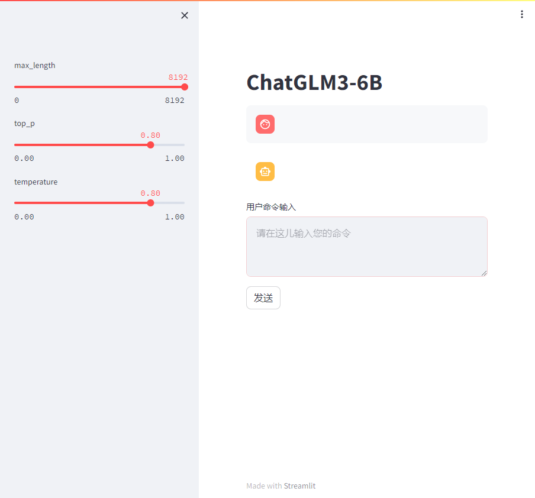

## ChatGLM3-6B

在现有平台的支持下，部署LLM比我想象中简单不少。
选择了pre trained ChatGLM3-6B，前后花了不到5min即打开了 Streamlit 网页端使用。


> 运行界面

推理速度还是很快的，甚至比 ChatGPT 3.5 网页端快一点。
但是具体表现来看还有待提高，同样的询问姓名评价问题下：

```bash
ChatGLM 3-6B:

张泽西这个名字非常有创意。它由两个汉字组成:张和泽

张姓为姓氏的一种，源远流长，张姓的来源可以追溯到周朝，是一个具有悠久历史和丰富文化的姓氏。泽字则表示广泛的水域，也象征着财富和福分。

因此，张泽西这个名字融合了姓氏文化和美好寓意，给人一种阳光、积极、富有福分的感觉。当然，名字的好坏还需结合实际个人和家庭的具体情况来评价。

GPT 3.5 : 

"张泽西" 是一个中国人的名字，它的含义和印象通常会受到个人的文化背景和社会环境的影响。通常情况下，名字的好坏是主观的，因此人们可能会有不同的看法。

如果您喜欢这个名字，觉得它适合您或您的孩子，那么它就是一个好名字。如果您有任何特定的疑虑或考虑，例如名字的发音、意义或文化背景，您可以考虑与家人、朋友或专业顾问讨论，以确保您做出了明智的选择。

总之，"张泽西" 是一个有中国文化特色的名字，具体是否适合您或您的需求，取决于您个人的喜好和情境。

GPT 4.0 : 

"张泽西"（Zhang Zexi）是一个汉语名字，由姓氏“张”和给定名“泽西”组成。在中文里，这个名字听起来很现代，也很有个性。姓氏“张”在中国是非常常见的姓氏之一，而“泽西”则相对少见，使得这个名字整体上比较独特。

名字的含义取决于“泽西”两个字的具体汉字和含义。一般来说，“泽”字可以有“水泽”、“恩泽”等含义，常常与广泛、丰富或恩惠相关联；“西”字则可能指方位西，或者是用作人名时的一个吉祥字。名字的好坏很大程度上取决于个人的偏好以及它在社会文化和语言环境中的意义。

如果你在寻找一个中文名字，这个名字可以是一个很好的选择，尤其是如果你喜欢它的发音和它可能的含义。在选择名字时，最重要的是它对你或名字的持有者来说意义何在。
```

仅从这一个问题来看，该模型效果略差。如果换一个训练参数数量更大的版本，效果肯定会好一些，后面有时间试着部署一个玩玩。

## 猫狗识别

熟悉了该平台的部署、设置训练任务的流程。